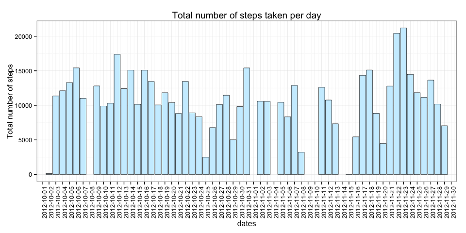
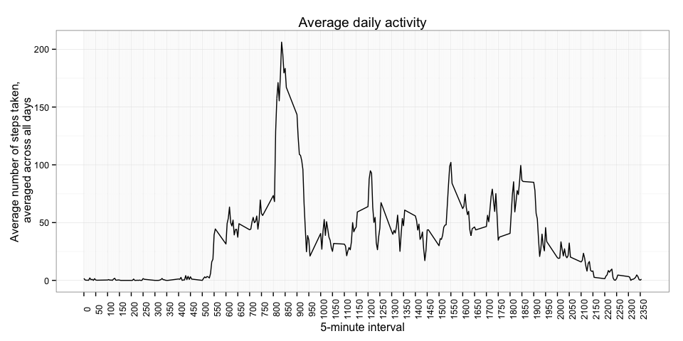
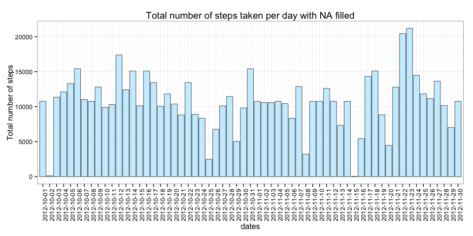
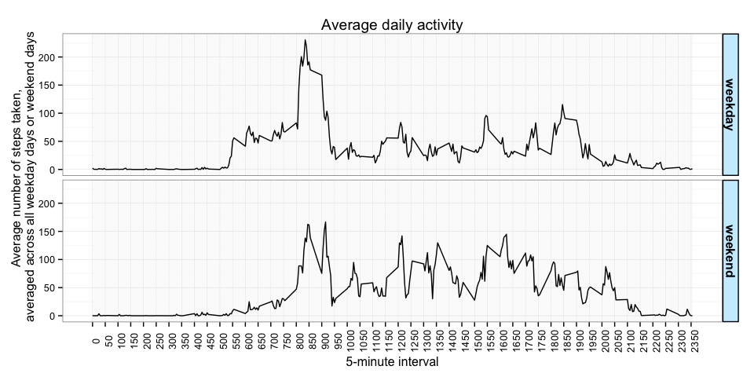

# Reproducible Research: Peer Assessment 1

```r
if(require("knitr")){
    print("knitr is loaded correctly")
} else {
    print("trying to install knitr")
    install.packages("knitr")
    if(require("knitr")){
        print("knitr installed and loaded")
    } else {
        stop("could not install knitr")
    }
}
```

```
## Loading required package: knitr
```

```
## [1] "knitr is loaded correctly"
```

```r
opts_chunk$set(echo = TRUE, fig.width = 10, fig.height = 5, fig.path="./figures/")
```

## Loading and preprocessing the data

```r
# Load the csv data from the zip file 
# Assure that `date` are converted to `Date` format
activity <- read.csv(unzip("./activity.zip"), 
                     header = TRUE, 
                     stringsAsFactors = FALSE, 
                     colClasses = c("integer", "Date", "integer"))
```

## What is mean total number of steps taken per day?

```r
# We will use the `reshape2` library
if(require("reshape2")){
    print("reshape2 is loaded correctly")
} else {
    print("trying to install reshape2")
    install.packages("reshape2")
    if(require("reshape2")){
        print("reshape2 installed and loaded")
    } else {
        stop("could not install reshape2")
    }
}
```

```
## Loading required package: reshape2
```

```
## [1] "reshape2 is loaded correctly"
```

```r
# We melt the `activity` data around the id `date` and `interval` with data being `steps`
activityMolten <- melt(activity, 
                       id = c("date", "interval"), 
                       measure.vars = "steps")

# We can then compute the `sum` of variable `steps` for each `date` to get the `Total number of steps per day`
activityMoltenTotalStepsPerDay <- dcast(activityMolten, 
                                            date ~ variable, 
                                            sum, drop = TRUE)


# We will use ggplot for all the graph of this report.
if(require("ggplot2")){
    print("ggplot2 is loaded correctly")
} else {
    print("trying to install ggplot2")
    install.packages("ggplot2")
    if(require("ggplot2")){
        print("ggplot2 installed and loaded")
    } else {
        stop("could not install ggplot2")
    }
}
```

```
## Loading required package: ggplot2
```

```
## [1] "ggplot2 is loaded correctly"
```

```r
ggplot(activityMoltenTotalStepsPerDay, aes(x=date, y=steps)) +
        geom_bar(stat = "identity", position = "identity", colour = "black", fill = "#CCEEFF", size = .25) +
        theme_bw() +
        theme(axis.text.x = element_text(angle=90)) + 
        scale_x_date(breaks = "1 day", limits=c(min(activityMoltenTotalStepsPerDay$date)+2,max(activityMoltenTotalStepsPerDay$date)-2)) +
        labs(title = "Total number of steps taken per day", x = "dates", y = "Total number of steps")
```

 


```r
# Mean value of the total number of steps per day
activityMoltenTotalStepsPerDayMean <-
        mean(activityMoltenTotalStepsPerDay$steps, na.rm = TRUE)

# Median value of the total number of steps per day 
activityMoltenTotalStepsPerDayMedian <- 
        median(activityMoltenTotalStepsPerDay$steps, na.rm = TRUE)
```

| Total number of steps taken per day | mean | median |
| :--- | :--- | :--- |
|  | 10766.19 | 10765.00 |

## What is the average daily activity pattern?

```r
activityMoltenAverageStepsPerInterval <- dcast(activityMolten, 
                                                   interval ~ variable, 
                                                   mean, 
                                                   na.rm = TRUE)

# Compute the interval with the maximum number of steps in average.
maxStepsInterval <- activityMoltenAverageStepsPerInterval[which.max(activityMoltenAverageStepsPerInterval$steps),"interval"]

ggplot(activityMoltenAverageStepsPerInterval, aes(x=interval, y=steps)) + 
        geom_line() + 
        theme_bw() +
        theme(axis.text.x = element_text(angle=90)) +
        scale_x_continuous(limits=c(0,2355), breaks=seq(0, 2355, by=50), minor_breaks=seq(0, 2355, by=5)) +
        labs(title = "Average daily activity", x = "5-minute interval", y = "Average number of steps taken,\n averaged across all days")
```

 

The 5-minute interval that contains the maximum number of steps on average across all days is **835**.

## Imputing missing values

```r
NAIndice <- which(is.na(activity$steps))
```
There are **2304 NA** values in this dataset.
We will replace those missing value by their **5-minute interval mean**.

```r
activityFilled <- activity
# 5-minute interval mean are already available in `activityMoltenAverageStepsPerInterval`
# For each NA value at the `NAIndice`, we take its `interval` value and search for it in `activityMoltenAverageStepsPerInterval$interval`. We can then get its mean steps value from `activityMoltenAverageStepsPerInterval$steps`.
activityFilled$steps[NAIndice] <- sapply(activity$interval[NAIndice], function(x) activityMoltenAverageStepsPerInterval$steps[activityMoltenAverageStepsPerInterval$interval == x])
```

With the NA values filled, we now replot the histogram of the average number of steps taken each day.

```r
# New melt
activityFilledMolten <- melt(activityFilled, 
                             id = c("date", "interval"), 
                             measure.vars = "steps")

# New `Total number of steps per day`
activityFilledMoltenTotalStepsPerDay <- dcast(activityFilledMolten, 
                                                  date ~ variable, 
                                                  sum, drop = TRUE)

ggplot(activityFilledMoltenTotalStepsPerDay, aes(x=date, y=steps)) +
        geom_bar(stat = "identity", position = "identity", colour = "black", fill = "#CCEEFF", size = .25) + 
        theme_bw() +
        theme(axis.text.x = element_text(angle=90)) + 
        scale_x_date(breaks = "1 day", limits=c(min(activityFilledMoltenTotalStepsPerDay$date)+2,max(activityFilledMoltenTotalStepsPerDay$date)-2)) +
        labs(title = "Total number of steps taken per day with NA filled", x = "dates", y = "Total number of steps")
```

 


```r
# New mean value of the total number of steps per day
activityFilledMoltenTotalStepsPerDayMean <-
        mean(activityFilledMoltenTotalStepsPerDay$steps, na.rm = TRUE)

# New median value of the total number of steps per day 
activityFilledMoltenTotalStepsPerDayMedian <-
        median(activityFilledMoltenTotalStepsPerDay$steps, na.rm = TRUE)
```

| Total number of steps taken per day | mean | median |
| :--- | :--- | :--- |
| With NA | 10766.19 | 10765.00 |
| With NA filled | 10766.19 | 10766.19 |

We can see that the NA values do not have too much influence on the dataset.

## Are there differences in activity patterns between weekdays and weekends?


```r
# Label each day as `weekday` or `weekend`
activityFilled$weekDayEnd <- sapply(activityFilled[["date"]], FUN = function(x) {
        if (weekdays(x) %in% c("Saturday","Sunday")){"weekend"} 
        else{"weekday"}
        })

# Make the label a factor
activityFilled$weekDayEnd <- as.factor(activityFilled$weekDayEnd)


activityFilledMolten <- melt(activityFilled, 
                        id = c("weekDayEnd", "interval"), 
                        measure.vars = "steps")

activityFilledMoltenAveragePerDay <- dcast(activityFilledMolten, 
                                                    weekDayEnd + interval ~ variable, 
                                                    mean, drop = TRUE)

ggplot(activityFilledMoltenAveragePerDay, aes(x=interval, y=steps)) + 
        geom_line() + 
        theme_bw() +
        facet_grid(weekDayEnd ~ .) + 
        labs(y = "Total number of steps" ) +
        theme(axis.text.x = element_text(angle=90), strip.text = element_text(face="bold", size=rel(1)), strip.background = element_rect(fill="#CCEEFF", colour="black", size=1)) +
        scale_x_continuous(limits=c(0,2355), breaks=seq(0, 2355, by=50), minor_breaks=seq(0, 2355, by=5)) +
        labs (title = "Average daily activity", x = "5-minute interval", y = "Average number of steps taken,\n averaged across all weekday days or weekend days")
```

 

```r
tapply(activityFilledMoltenAveragePerDay$steps, list(activityFilledMoltenAveragePerDay$weekDayEnd), sum)
```

```
## weekday weekend 
##   10256   12202
```

We can see that the total average number of steps for weekdays and weekends are about the same.  
However, during weekdays there is a peak of activity occuring around **8:35** and then around the **end of the afternoon**, i.e. around **commuting periods of time**. Whilst, during weekend the activity is spreaded over the whole day.
